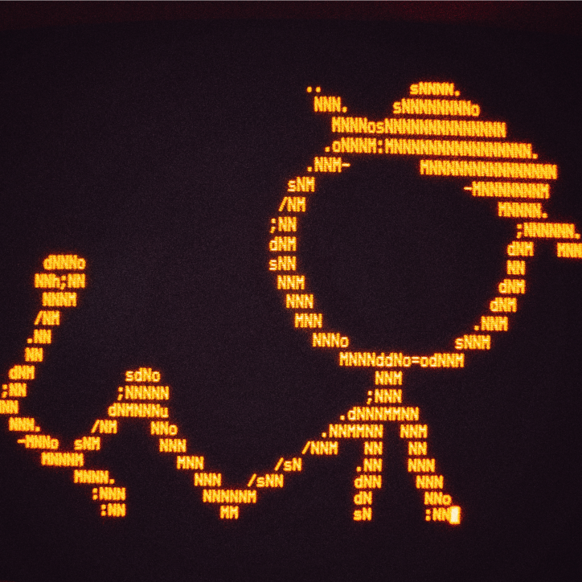

<!---
CRThaze/CRThaze is a ✨ special ✨ repository because its `README.md` (this file) appears on your GitHub profile.
You can click the Preview link to take a look at your changes.
--->

Hi, I’m @CRThaze (Diego Fernando Carrión)

I mostly maintain my personal projects on:
- [Codeberg](https://codeberg.org/CRThaze)
- [SDF](https://git.sdf.org/CRThaze)
- [My Own Server](https://git.xn--e-0fa.net)

I mainly use Github for contribution to other projects hosted here, but also to
host some "vibe coded" ~slop~ stuff, and other things that are here for
historical, compatability, or other similiar reasons.
